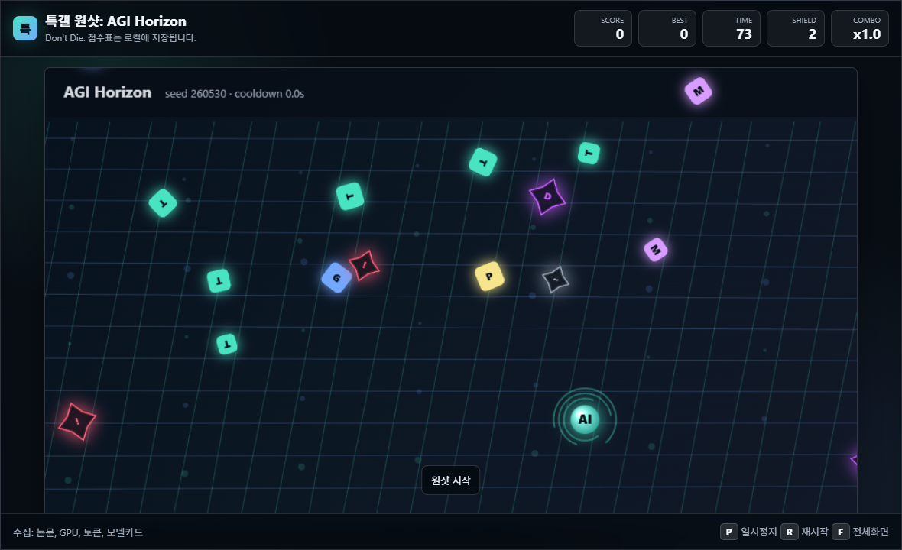
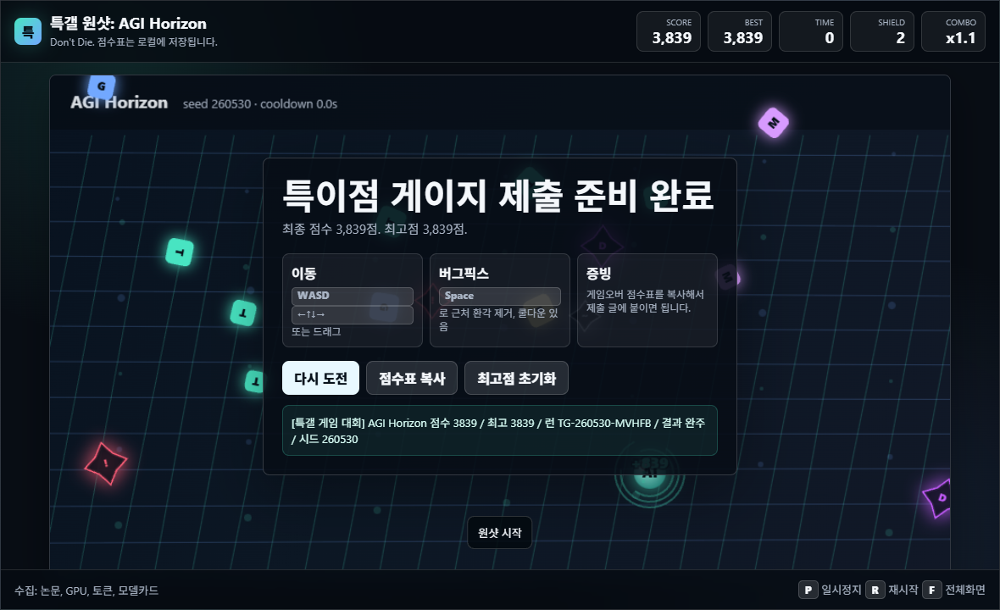

# AGI Horizon

특갤 게임 제작 대회용 원샷 미니게임입니다. 브라우저에서 `index.html`을 열면 바로 실행됩니다.

## 플레이

- 이동: `WASD`, 방향키, 또는 드래그
- 버그픽스 펄스: `Space`
- 일시정지: `P`
- 재시작: `R`
- 전체화면: `F`

75초 동안 논문, GPU, 토큰, 모델카드를 수집하고 환각, 한도초과, 도배기, 렉을 피합니다.

## 점수

- 수집 점수에 콤보 배율이 적용됩니다.
- 피격 시 쉴드가 줄고 점수가 일부 감소합니다.
- 완주 보너스와 남은 쉴드 보너스가 최종 점수에 더해집니다.
- 최고점은 브라우저 `localStorage`에 저장됩니다.
- 게임오버 화면에서 제출용 점수표를 복사할 수 있습니다.

## 검증

자동 스모크 결과는 `verification-smoke-result.json`에 저장했습니다.

확인 항목:

- 시작
- 이동
- 점수 증가
- 게임오버
- 재시작
- 점수표 버튼 표시
- 콘솔 오류 없음

## 스크린샷

